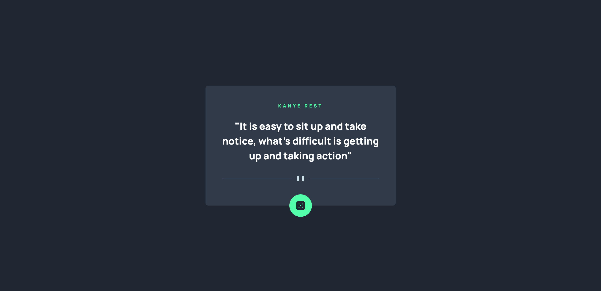

# Frontend Mentor - Advice generator app solution

This is a solution to the [Advice generator app challenge on Frontend Mentor](https://www.frontendmentor.io/challenges/advice-generator-app-QdUG-13db). Frontend Mentor challenges help you improve your coding skills by building realistic projects.

## Table of contents

- [Frontend Mentor - Advice generator app solution](#frontend-mentor---advice-generator-app-solution)
  - [Table of contents](#table-of-contents)
  - [Overview](#overview)
    - [The challenge](#the-challenge)
    - [Screenshot](#screenshot)
    - [Links](#links)
  - [My process](#my-process)
    - [Built with](#built-with)
    - [Useful resources](#useful-resources)
  - [Author](#author)

## Overview

### The challenge

Users should be able to:

- View the optimal layout for the app depending on their device's screen size
- See hover states for all interactive elements on the page
- Generate a new quote by clicking the dice icon

### Screenshot

### Links

- Solution URL: https://www.frontendmentor.io/solutions/quote-generator-app-gao2x14od3
- Live Site URL: https://andrew2764.github.io/quote-generator/

## My process

### Built with

- Vanilla HTML CSS JS
- Flexbox
- Mobile-first workflow

### Useful resources

- [Kanye Rest](https://kanye.rest/) - Originally I was using an advice generator api but it seemed like the api was not working properly as it kept giving the same response each time. So I decided to use this api instead to generate quotes.

## Author

- Frontend Mentor - [@andrew2764](https://www.frontendmentor.io/profile/andrew2764)

